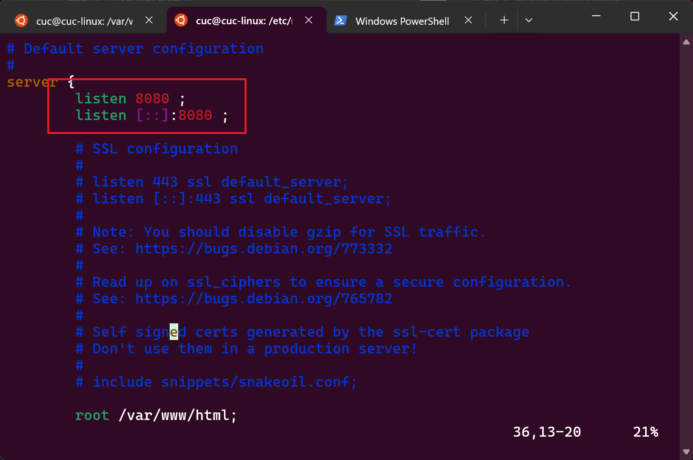

# 第五章：Web服务器（实验）
## 环境配置：
### 1. Nginx配置：
**下载安装Nginx**

使用apt直接下载安装Nginx，若已经安装则会显示已存在

```bash
sudo apt install nginx
```


**检验Nginx是否正常运行**

直接在浏览器中输入Ubuntu主机的ip地址，若出现Nginx默认页面则表示Nginx配置成功


**查看Nginx日志**

在命令行中输入执行下面的命令打开Nginx的日志，查看访问情况

```bash
tail -F /var/log/nginx/access.log
```


同时刷新浏览器中的Nginx页面，查看日志输出是否更新，出现更新，说明日志和Nginx本身功能正常


### 2. VeryNginx配置：

**安装配置VeryNginx**

首先找到VeryNginx的github地址，克隆地址到本地

```bash
git clone https://github.com/alexazhou/VeryNginx.git
```


运行文件夹下的py安装文件，下载安装必要的环境文件

```bash
python3 install.py install
```


若安装成功，则会有以下输出显示：


修改Nginx的配置文件，将VeryNginx的端口号和user进行修改，分别修改为`www-data`和`80`，同时，将Nginx的端口修改为`8080`


Nginx修改如下：

```bash
sudo vim /etc/nginx/sites-available/default
```



VeryNginx修改如下：

```bash
 vim /opt/verynginx/openresty/nginx/conf/nginx.conf
```


**测试VeryNginx功能**

下面测试VeryNginx的功能,当输入下面命令并执行时，可以启动VeryNginx，在主机IP的80的端口中可以打开查看

```bash
sudo /opt/verynginx/openresty/nginx/sbin/nginx
```
未启动时：


启动后：
在浏览器中输入http://192.168.56.102/verynginx/index.html ，进入登录界面
账号和密码默认均为`verynginx`


通过此页面可以监控访问情况


当通过手动增加访问量时，监控浏览器页面的变化，若随之出现凸起波峰，则证明监控功能正常

```bash
curl http://192.168.56.102:8080
```


### 3. PHP-FPM7.2配置：
**下载安装PHP-FPM7.2**

通过询问大模型，了解安装7.2版本的fpm方法


进行实操：
首先安装必要工具以获取到固定版本的fpm


正式开始下载安装fpm


在/var/www/html/目录下新建一个php文件，内容为简单的查看所有信息php脚本：

```bash
<?php
phpinfo();
```

重启nginx后进入浏览器，访问http://192.168.56.102:8080/test.php ，即可看到php的版本信息


### 4. Wordpress配置：

**下载安装Wordpress**

通过下述命令直接将wordpress4.7版本安装到Ubuntu主机中,并进行解压

```bash
wget https://wordpress.org/wordpress-4.7.1.tar.gz
tar -xvzf wordpress-4.7.1.tar.gz
```


**配置wordpress**
将解压的文件目录全部copy到 `/var/www/html/`目录下
```bash
sudo cp -r wordpress/* /var/www/html/
```


为wordpress创建数据库


将目录下的配置文件复制后编辑


修改部分如下，其中数据库部分为前面刚刚在MySQL服务器上建立的新数据库的内容


该部分内容的配置可以点击链接直接复制网页生成的内容：


继续配置nginx的default配置文件，使网页能使用静态读取


配置结束后重启nginx和数据库，在浏览器中打开主机IP和端口，会弹出安装界面


安装完成后进入主页


此时，为让外部访问的地址为 http://wp.sec.cuc.edu.cn 需修改default配置文件中的server_name并重启nginx，同时，还需要在主机(打开浏览器的设备)中修改hosts文件，将`wp.sec.cuc.edu.cn`指向主机(Ubuntu)的IP地址


最后的效果如图：


### 5. dvwa配置：
**配置dvwa**
首先将dvwa下载到Ubuntu主机中，然后解压，将解压后的dvwa文件夹复制到`/var/www/`目录下，同时，给www-data用户赋予读写权限


复制重命名（删掉dist）并修改dvwa的配置文件，将数据库的配置信息修改为MySQL服务器上创建的dvwa数据库的信息


复制一份nginx的default配置文件到dvwa中，并修改相关配置，其中实现域名替代ip的步骤和wordpress中的一致


此时，在sites-eabled会同时生成一份dvwa配置文件，将其软链接`ln`到available中的dvwa文件，然后重启nginx，在浏览器中打开dvwa的网址，即可进入dvwa的登录界面


创建数据库并进行登录


成功进入界面


但是当当访问其中的模块时，会发现网页出现了渲染混乱错误，经查看是目录中的文件错误加载，通过询问大模型并对照之前直接复制default的配置文件，发现有许多地方需要修改


最终的修改配置如下：


经测试，可正常渲染网页


## 环境配置完成，正式开始实验
## 基础要求：
### 1. 反向代理配置

通过verynginx添加match，捕获wordpress和dvwa的访问


然后通过配置下图的内容将访问dvwa和wordpress的域名请求转化为127.0.0.1:8080的请求，即wordpress和dvwa的ip访问


访问效果如下


## 安全加固要求：
### 1. 使用IP地址方式均无法访问上述任意站点，并向访客展示自定义的友好错误提示信息页面-1

首先通过询问大模型获取match的匹配条件：


在matcher中进行配置：


进一步配置response，该步骤的作用是当match命中了条件后，经过过滤器可以执行response中的动作内容，因此，自定义的友好化界面也是在这一步中实现


继续完善filter


当一切完毕后会发现，verynginx的网页也无法访问，并且会显示自定义的友好化页面


此时为了继续进行实验，这里展示实验中使用到的第一种解决方式：直接在hosts中增加后一个映射ip的域名


重新使用域名打开发现可以正常使用verynginx的网页


此时，继续实验，验证是都之前的效果对上述的任意站点均有效，经测试，发现确实只要满足match的条件均有效，下面是配置了match和response等的前后对比：
配置前：


配置后


### 2. Damn Vulnerable Web Application (DVWA)只允许白名单上的访客来源IP，其他来源的IP访问均向访客展示自定义的友好错误提示信息页面-2

同样的道理，依次配置matcher、response、filter，配置方式如下：

这里的ip随便选了一个VPN的ip作为白名单，如果主机无法访问，则证明有效


下面进行效果测试，经测试，发现确实主机ip无法访问，并且出现了友好提示界面


### 3. 在不升级Wordpress版本的情况下，通过定制VeryNginx的访问控制策略规则，热修复WordPress < 4.7.1 - Username Enumeration

首先，了解这个漏洞的具体内容，通过打开实验要求中的链接，发现这个漏洞是WordPress < 4.7.1版本中的漏洞，该漏洞是WordPress中一个用户名枚举漏洞，该漏洞通过访问wp-login.php页面，通过输入错误的用户名来获取用户名是否存在，从而实现用户名枚举。


进行测试直接将其代码中的地址输入浏览器，确实返回了用户信息：


下面通过依次配置matcher、filter，进行修复，配置方式如下：


配置完毕后再次进行测试，发现确实无法访问，漏洞被修复


### 4. 通过配置VeryNginx的Filter规则实现对Damn Vulnerable Web Application (DVWA)的SQL注入实验在低安全等级条件下进行防护

首先修改难度为low


和之前的一样，依次配置matcher、filter，匹配SQL注入所用到的敏感字符配即可：


经测试确实无法再进行注入

### 5. VeryNginx的Web管理页面仅允许白名单上的访客来源IP，其他来源的IP访问均向访客展示自定义的友好错误提示信息页面-3

同之前配置黑白名单的方式一样,只是变成了两个匹配条件，其他的都一样，配置方式如下：


当配置完filter并保存后会发现，有被封掉了verynginx外面，此时，之前已经演示过了一种方式，这里演示另外一种解决手段————直接修改配置文件


进入verynginx的相关目录，找到verynginx.conf文件，修改其中的配置，将白名单对应的过滤器打成false即可（原来为true）


重新加载verynginx


打开网页重新进入发现可以正常访问，而之前filter中的相应配置前也变成了叉号


经这么一些操作，也可以验证确实白名单外的ip无法访问verynginx的网页
### 6.通过定制VeryNginx的访问控制策略规则实现：
#### 限制DVWA站点的单IP访问速率为每秒请求数 < 50，限制Wordpress站点的单IP访问速率为每秒请求数 < 20，超过访问频率限制的请求直接返回自定义错误提示信息页面-4
可以先在response中配置返回的HTML错误页面，然后通过frequency limit进行访问次数控制：


当一切完毕后，可以在Ubuntu中使用apcher访问网页进行压力测试，首先，下载安装相关的工具：


安完后输入下面的内容分别进行测试，


其中可以发现，在对wp进行的测试中，有80个请求失败了，这与之前填写的访问控制规则的内容一致，证明确实实现了访问次数的控制


#### 禁止curl访问
该步骤与之前的方法类似，直接设置matcher和filter即可，但是为了更可视化体现效果，这里多设置了response，配置方式如下：


response


经测试确实无法通过curl访问，下图中最上面的命令之所以能够执行是因为白名单的优先级在curl的上面，会先对白名单进行检测，当然通过页面也可以修改优先级让curl在所有的过滤条件上面


## 遇到的问题及解决方法

1. 环境配置问题，在配置dvwa时多次尝试，页面均为forbidden，最后发现是因为nginx的dvwa配置文件中的index变量中`index.php`没有被添加,添加后便可正常访问
2. dvwa的各个模块页面进入会排版混乱
3. 通过搜索资料和询问大模型，再加上对各个配置文件挨个排错穷举，最后发现是因为nginx中的dvwa配置文件是直接copy的wordpress的default文件，其中好多内容都不满足要求，通过官方文档和大模型给出的代码替换后得以正常显示。
4. 在进行安全加固时，不小心将verynginx的网页也设置了访问控制，导致主机无法访问，通过询问大模型，修改了在主机中的hosts文件，将ip访问替换为域名访问，问题解决。
5. 其他涉及到的小问题和解决手段大多在报告中已经体现。

## 参考链接：
[chap0x05/第五章：Web服务器（实验）.md](https://github.com/CUCCS/2022-linux-public-excuses0217/blob/main/chap0x05/%E7%AC%AC%E4%BA%94%E7%AB%A0%EF%BC%9AWeb%E6%9C%8D%E5%8A%A1%E5%99%A8%EF%BC%88%E5%AE%9E%E9%AA%8C%EF%BC%89.md)

[智谱清言](https://chatglm.cn/main/alltoolsdetail)

[verynginx](https://github.com/alexazhou/VeryNginx)

[DVWA](https://github.com/digininja/DVWA/blob/master/README.zh.md)

[DVWA的安装与配置教程+文件](https://blog.csdn.net/curious233/article/details/113336530)  
 
[Exploit Database](https://www.exploit-db.com/exploits/41497)